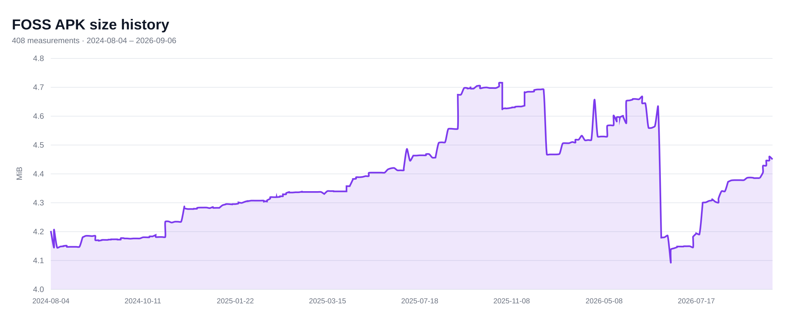

# LibChecker assets

## FOSS APK size history

Each point is the FOSS APK `packageSize` recorded by a valid `ci.json` commit.

<picture>
  <source media="(prefers-color-scheme: dark)" srcset="./apk-size-history-dark.svg">
  <source media="(prefers-color-scheme: light)" srcset="./apk-size-history-light.svg">
  
</picture>
